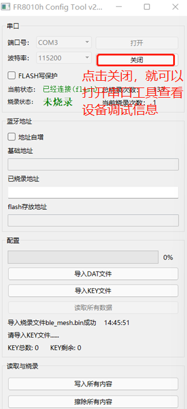
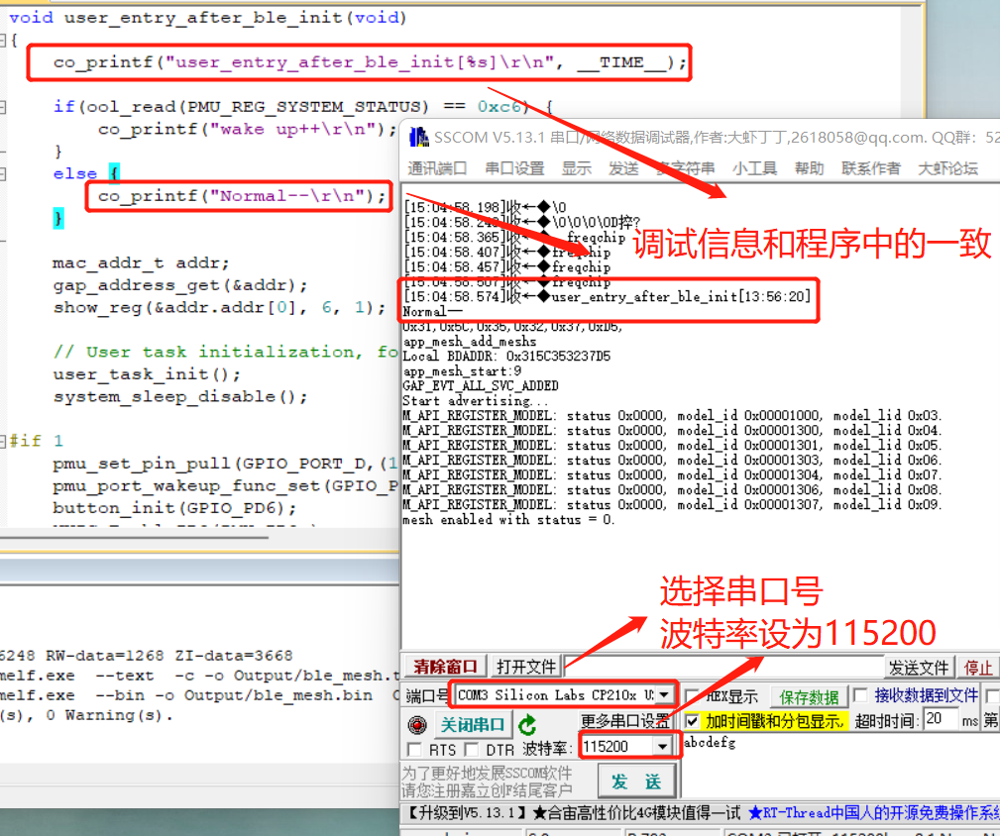

# 1.  开发环境搭建 #

-   Keil软件的安装

-   安装SDK所需的芯片包

> 富瑞坤FR8016属于ARM3内核架构，所有只需安装Keil.STM32F4xx_DFP.1.0.8.pack就可以
>
> 1，打开Keil软件中的Pack
> Installer图标，在file菜单栏下选择Import如下图所示
>
>  
>
> 2，选择Keil.STM32F4xx_DFP.1.0.8.pack所在路径开始导入即可，导入完成如下图所示：
>
>  

2.  Mesh Node工程的编译及烧录

-   打开SDK工程：

> FR8016H_Mesh_Node_Sdk\\examples\\none_evm\\ble_mesh_PB_Remote\\keil\\ble_mesh并执行编译，如下图所示：
>
>  
>
>  
>
>  

-   烧录固件

1.  接上硬件后我们首先查看串口能否识别（使用串口烧录固件），如下图所示

>  
>
> 可以看到硬件串口未被电脑识别到，接着我们需要安装串口驱动

2.  打开串口驱动所在文件，以管理员身份运行即可，如下图所示

>  
>
>  
3.  开始烧录固件

>  
>
> 其中第4步中生成的固件地址为：F:\\Mesh节点相关资料\\SDK\\FR8016H_Mesh_Node_Sdk\\examples\\none_evm\\ble_mesh_PB_Remote\\keil\\Output\\ble_mesh.bin文件
>
> 串口烧录工具所在位置为：Mesh节点相关资料\\SDK\\FR8016H_Mesh_Node_Sdk\\tools，如下图所示：
>
>  

4.  烧录成功所示界面

> {width="2.7090277777777776in"
> height="5.925in"}

5.  设备调试信息查看

> 

