#1.  Mesh节点功能及硬件平台介绍：
此Mesh节点使用富芮坤FR8016HA主控芯片及适配SDK的基础上实现PDV和GATT的Mesh配网方式，可以控制彩灯的开关，颜色及亮度设置。其它功能开发者可以根据自己的业务需求在此基础上实现
其中主控硬件资源介绍如下：
 
1.  ## 功能框图  ##
    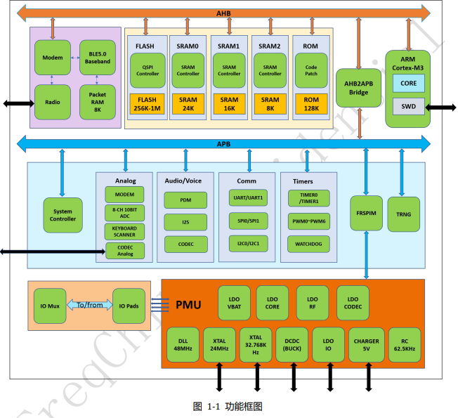

2.  特性：
      - CPU：内置 32 位 ARM CortexM3 内核，支持 浮点运算单元，支持最高 48MHz的时钟频率
      - 存储器：512KB Flash 用户软件和数据存储
      - 48KB SRAM
      - 128KB ROM
        - BOOT 启动代码；控制器(controller)协议栈
      - ROM固件 
        - BLE Profile & Protocol: GATT, LM, LC
      - 蓝牙	
        - 支持V5.1 LE标准
        - 支持2M/1M/500k/125K 数据速率***
    

3.  ## 硬件Flash空间分配情况 ##

    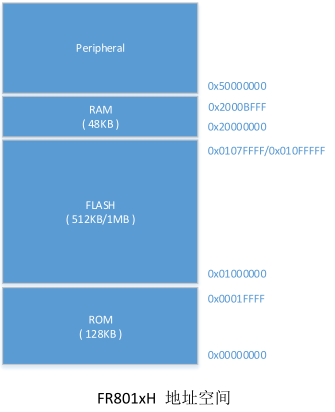 

    其中内置128KB ROM：启动代码、BLE controller 部分协议栈

    FLASH ：用于存储用户程序、用户数据等
    RAM ： 用于存储各种变量、堆栈、重新映射后的中断向量地址、对运行速度较为敏感的代码（中断响应等）

    Peripheral ：各种外设的地址映射，用于进行外设的配置

4.  SDK结构

    SDK包含完整的BLE5.0协议栈，有controller，host，profile，SIG
    Mesh等部分。其中蓝牙协议栈的 controller

    和 host 部分以及操作系统抽象层 OSAL
    都是以库的形式提供（下图中灰色显示），MCU外设驱动

    ，Profile以及应用层的例程代码是以源码的形式提供（图中绿色部分显示）

    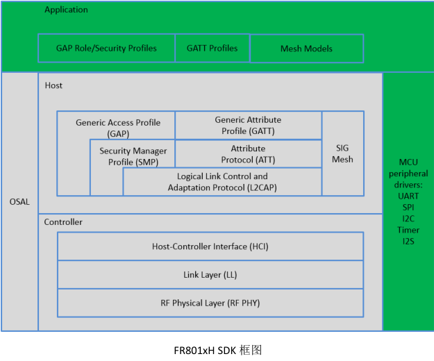 

5.  SDK启动流程介绍

    SDK 包含了四大部分，Application 部分，蓝牙协议栈部分，操作系统抽象层
    OSAL 部分，还有 MCU 外

    设驱动部分。整个代码结构比较简单，执行流程也很清晰易懂。SDK 的 main
    函数主体入口位于 lib 库

    中，对于应用层以源码形式开放了一些入口，用于应用开发初始化，基本流程如下图所示：

    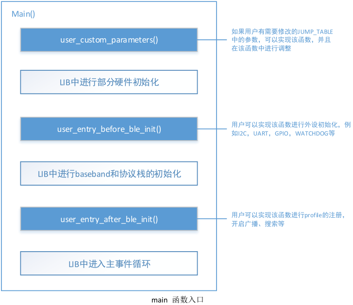 

    如在本SDK 中的**user_entry_before_ble_init**函数中有如下操作

    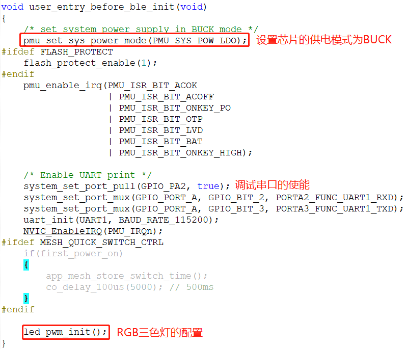 

    **user_entry_after_ble_init**函数中有如下操作

    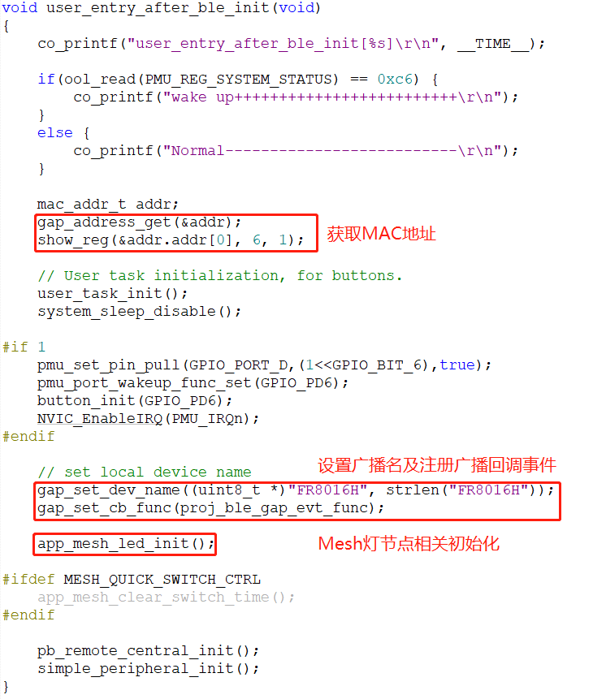 

 
 
1.  Mesh灯节点初始化函数：**app_mesh_led_init** 
    该函数主要完成Mesh灯节点特性设置，Mesh消息事件处理函数的注册，模型添加等操作

    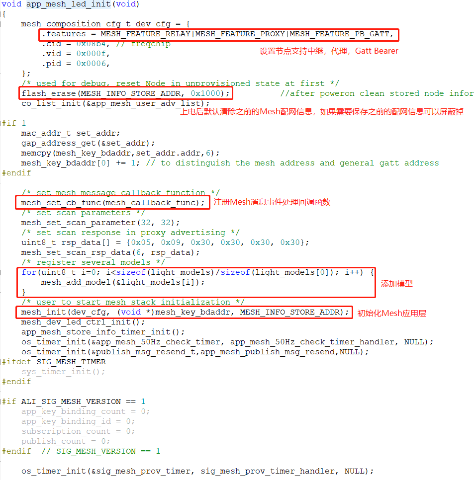 

2.  Mesh消息事件处理回调函数

    该回调主要处理Mesh功能初始事件，Mesh配网事件，模型消息事件，相关事件说明如下：

    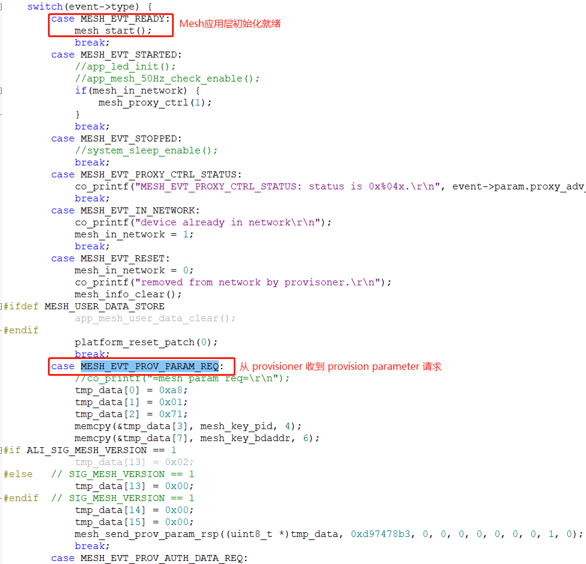 

    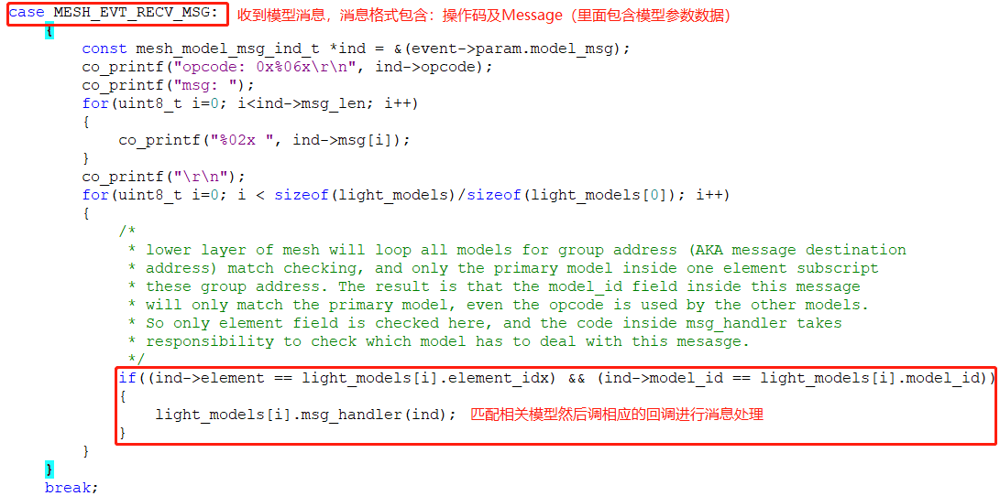 

3.  节点模型添加示例

    如下图为SDK中所添加的模型，如果想添加厂商自定义模型可以参照这个

    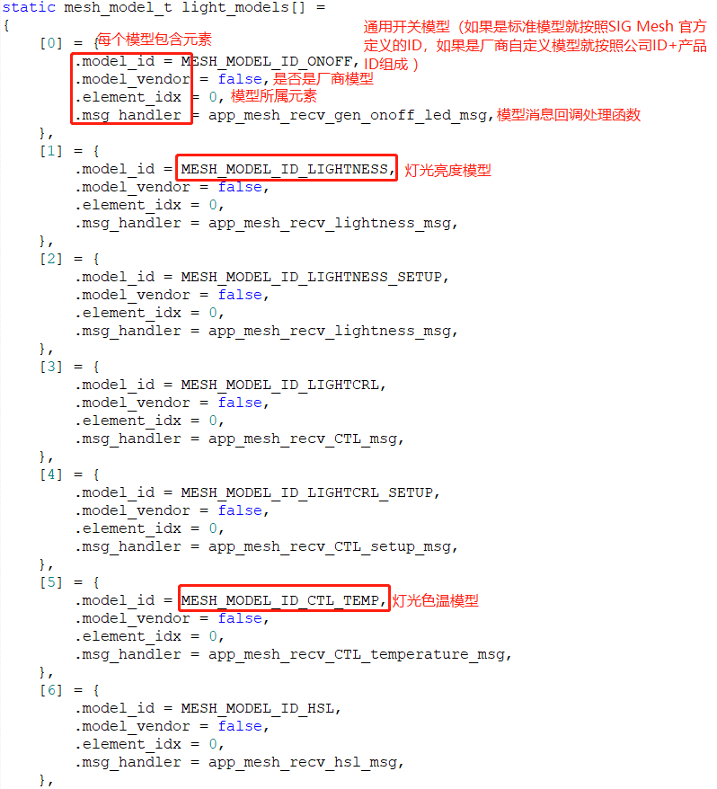 

    OnOff模型的消息的回调处理

     

    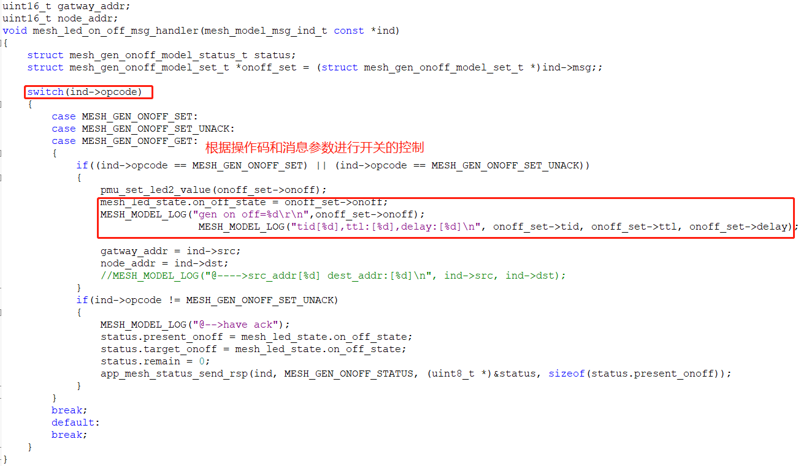 

    4，彩灯引脚驱动初始化

    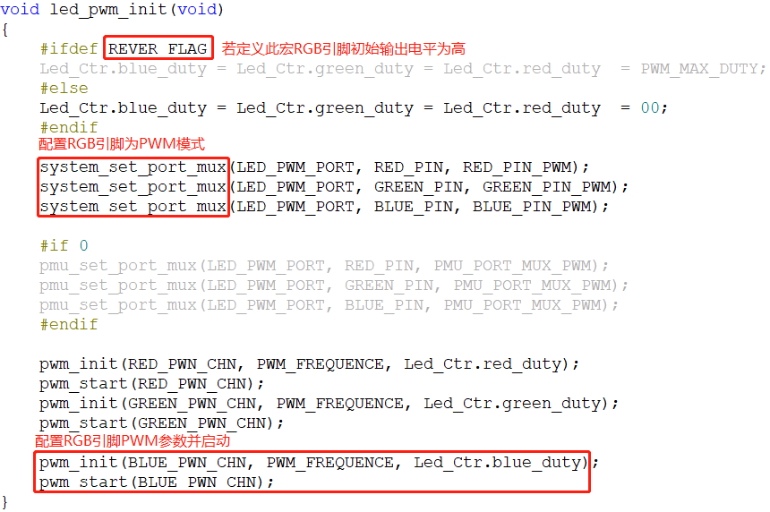 

    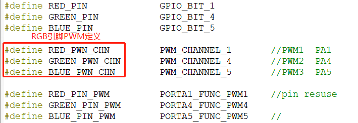 
 