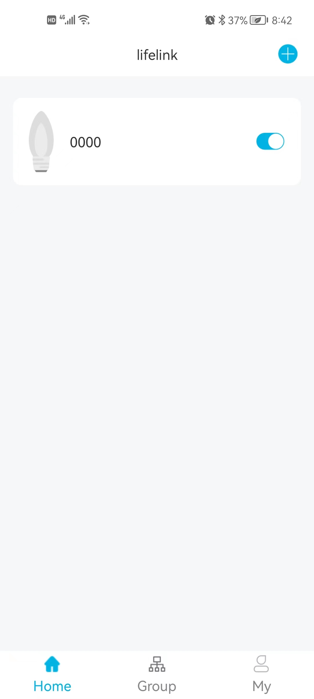
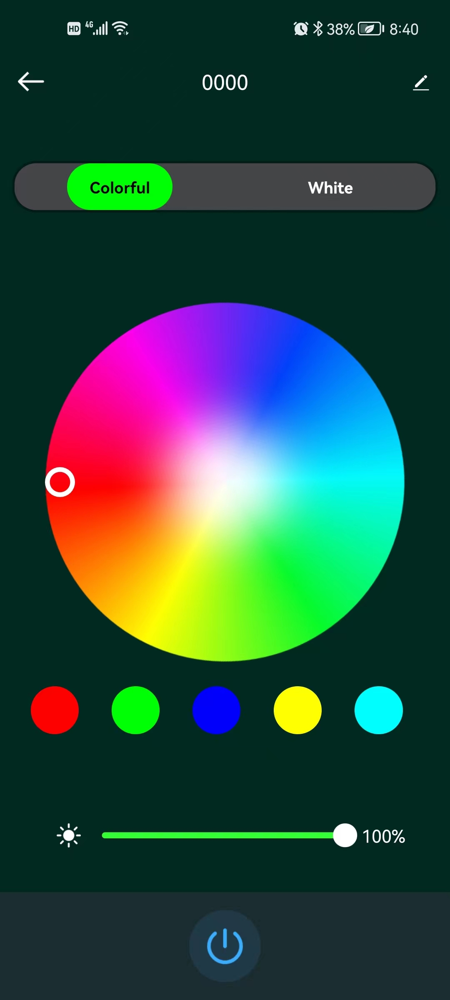
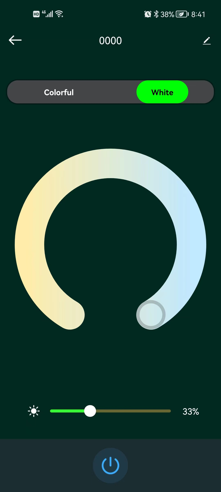
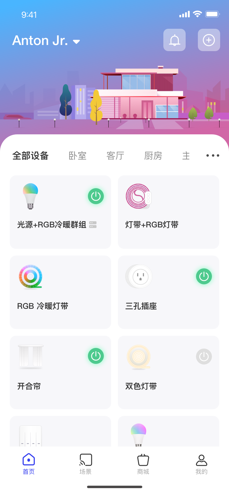
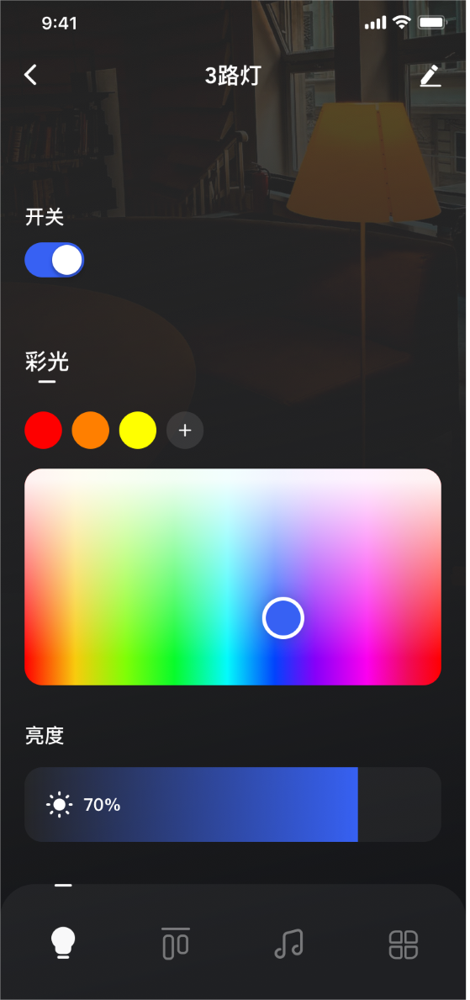

#3721 Open Sig Mesh

#### 介绍

Bluetooth Mesh(Sig Mesh)是Bluetooth SIG组织在2017年7月17日发布的蓝牙Mesh标准，支持创建大规模设备网络,适本地构建自动化并提供多种物联网 (IoT) 解决方案。

此工程为Sig Mesh应用产品开源集合，从子节点设备，网关，APP全系列开放开源
为行业社区打造更多的标准Sig Mesh硬件生态，欢迎大家一起参与进来。

此Mesh节点使用富芮坤FR8016HA主控芯片及适配SDK的基础上实现PDV和GATT的Mesh配网方式，可以控制标准设备，如彩灯的开关，颜色及亮度设置。
其它功能开发者可以根据自己的业务需求在此基础上实现，Demo用例直接使用通用模组编程，也可自定义PCBA芯片进行编程。

#### 目录：
	Node_led     智能灯源代码
	Node_switch  智能开关源代码（内测中，代码请加微信群)
	Node_plug    智能插座源代码（内测中，代码请加微信群)
	

####  开发教程

1.  [开发环境](Doc/FR8016HA/GettingStarted/README.md)
2.  [开发入门](Doc/FR8016HA/README.md)
3.  APP
4.  WIFI Sig Mesh 网关

#### APP

Android/iOS支持，分为MQTT云上版本和单机版
支持单控，群控等功能
单机版 

  

MQTT版  

 

#### 模组
模组格式书

#### WIFI网关

WIFI网关，已实现MQTT和SigMesh模型上行和下行，支持标准MQTT3.1.1。

#### 加好友进微信群

#### 参与贡献
1.  Fork 本仓库
2.  新建 Feat_xxx 分支
3.  提交代码
4.  新建 Pull Request
